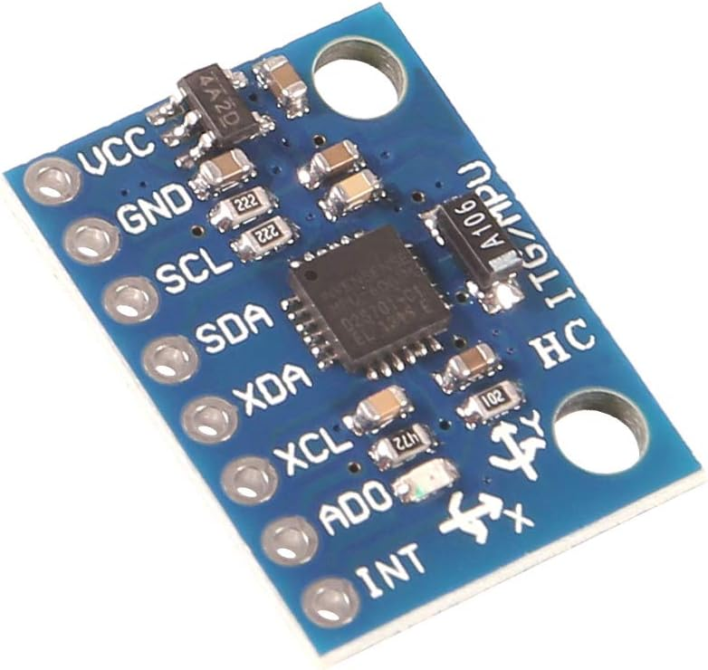
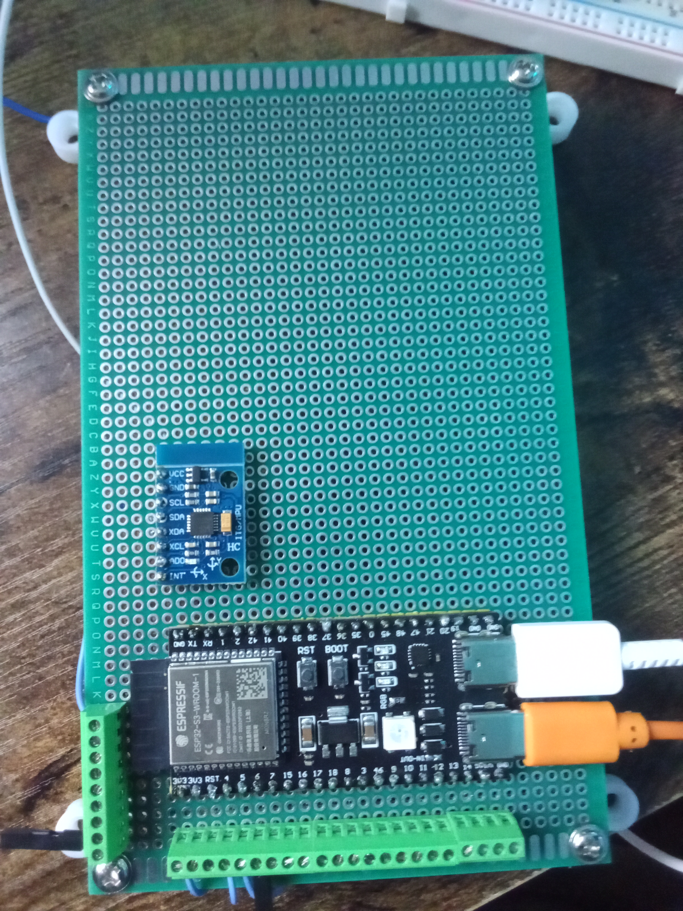
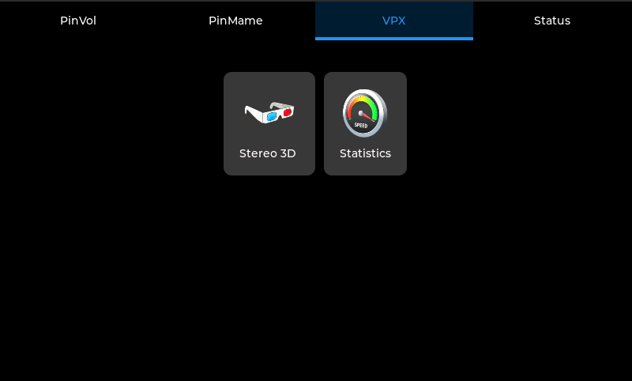
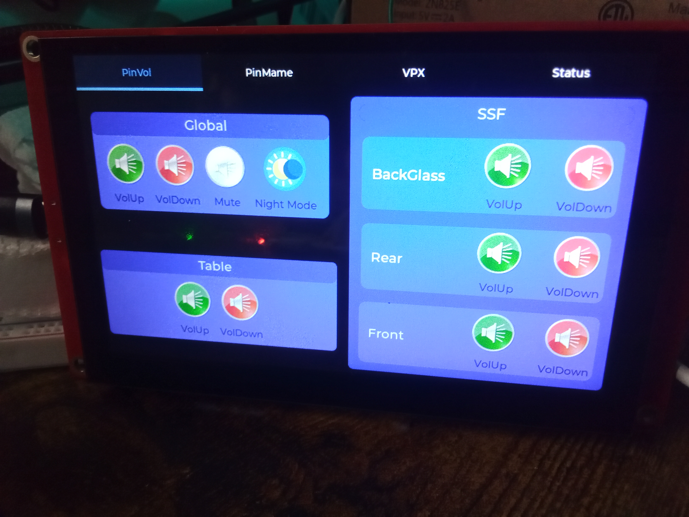

# Overview

The project is made of two separate components with the following features:
- Controller (pinCommander-controller)
  - 21 Button Support (Gamepad HID)
  - Nudge support via (Gamepad X/y axis mapping via the MPU6050)
  - Keyboard and Consumer HID
  - Private WiFi network for connecting to other compenents (e.g. the HMI). 
- HMI (pinCommander-hmi)
  - Supports Pinvol and Pinmame keymaing to a UI button interface
## Controller
My devlopment is based on the [ESP32-S3-DevKitC-1 board](https://docs.espressif.com/projects/esp-idf/en/latest/esp32s3/hw-reference/esp32s3/user-guide-devkitc-1.html).  Its the "N8R2" varient with OCTA PSram. 

### Current IO mapping:

### MPU6050 (accelerometer)
This is used for implementing the nudging sensor input to VPX.

My dev setup:

## HMI
The HMI unit is [Elecrow 5"](https://www.elecrow.com/esp32-display-5-inch-hmi-display-rgb-tft-lcd-touch-screen-support-lvgl.html) varient.

### HMI Interface Screenshots
Pinvol:

PinMame

VPX

Status

My dev setup:

